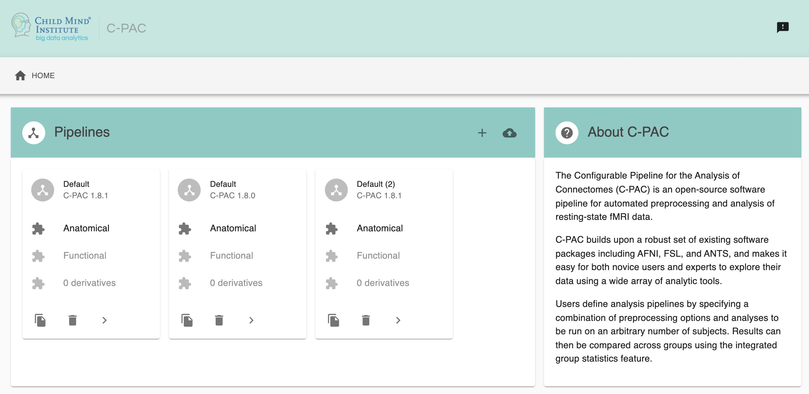

# C-PAC OpenTutorials

Demo resources for C-PAC OpenTutorials talk

## QuickStart

### Step 1. Clone Repository
```
git clone https://github.com/XinhuiLi/OpenTutorials.git
```

### Step 2. Pull C-PAC
```
docker pull fcpindi/c-pac:latest
```

### Step 3. Run C-PAC
```
docker run -i --rm \
-v /Users/You/OpenTutorials/data:/bids_dataset \
-v /Users/You/OpenTutorials:/outputs \
-v /tmp:/scratch \
fcpindi/c-pac:latest /bids_dataset /outputs participant --pipeline_file /outputs/pipeline_config.yml
```

#### Useful Arguments
```
--pipeline_file <pipeline_config.yml>

--data_config_file <data_config.yml>

--preconfig <anat-only/benchmark-ANTS/benchmark-FNIRT/fmriprep-options/monkey/rodent etc.>

--participant_label <participant label>

--save_working_dir
```

## Data Config
[Data config template](./data_config.yml)

## Pipeline Config
[Pipeline config template](./pipeline_config.yml)

You can use text editor or [C-PAC GUI](https://fcp-indi.github.io/C-PAC_GUI/#/) to edit your pipeline config file.



## For More Details
User documentation: https://fcp-indi.github.io

C-PAC forum: https://groups.google.com/forum/?utm_medium=email&utm_source=footer#!forum/cpax_forum

C-PAC GitHub: https://github.com/FCP-INDI/C-PAC